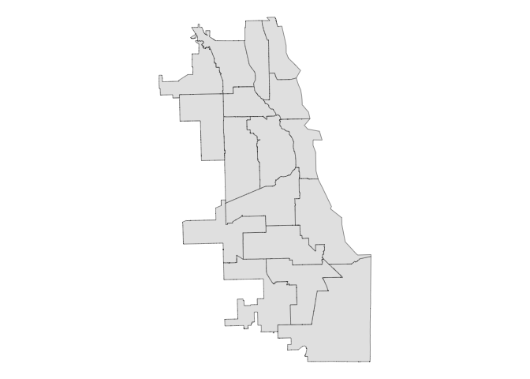
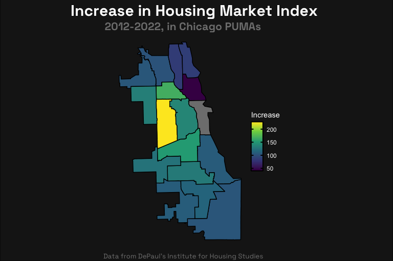
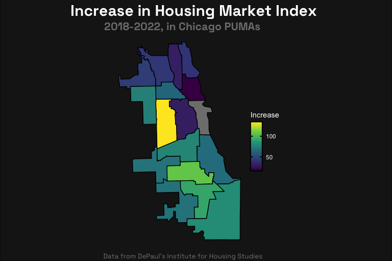

Chicago Housing Market Data Exploration
================

Step 1 is the load the libraries.  
The knitr options are to set the root directory (for rendering) to the
project’s directory.  
It’s dumb that it isn’t that by default.

``` r
# packages
library(tidyverse)
library(sf)
library(lubridate)

# directory setup
library(here)
library(knitr)

# change root directory to Rproj file location;
# that's where all files are pulled from
knitr::opts_knit$set(root.dir = here())
```

Then we read in the shapefile of the PUMAs and render as a test.

``` r
il_pumas <- read_sf(here("SHP", 
                         "SHP_illinois_PUMAs/tl_2020_17_puma10.shp")
                    )
chicago_pumas <- il_pumas %>% 
  filter(grepl("Chicago City", NAMELSAD10) & !grepl("Cook", NAMELSAD10))
ggplot(chicago_pumas) +
  geom_sf() +
  theme_void()
```



The PUMA names don’t match the CSV PUMA names, so I remove some of the
fluff.

``` r
chicago_pumas$NAMELSAD10 <- str_match(chicago_pumas$NAMELSAD10, ".*\\-\\-(.*)")[,2]
chicago_pumas$NAMELSAD10 <- str_remove(chicago_pumas$NAMELSAD10, " PUMA")
```

Then we read in the CSV and filter to 2012+ and 2018+.

``` r
price_index_data <- read_csv(here("CSV", 
                                  "CSV_IHS-price-index-data.csv")
                             ) %>% 
  gather(2:17, key = "PUMA", value = "Index")
```

    Rows: 102 Columns: 17
    ── Column specification ────────────────────────────────────────────────────────
    Delimiter: ","
    dbl  (16): Edgewater, Uptown & Rogers Park, Lake View & Lincoln Park, West R...
    date  (1): Date

    ℹ Use `spec()` to retrieve the full column specification for this data.
    ℹ Specify the column types or set `show_col_types = FALSE` to quiet this message.

``` r
price_index_data$Date <- ymd(price_index_data$Date)

price_index_data_diff_2012 <- price_index_data %>% 
  filter(Date == "2012-01-01" | Date == "2022-01-01") %>% 
  group_by(PUMA) %>% 
  summarize(diff = max(Index) - min(Index))

price_index_data_diff_2018 <- price_index_data %>% 
  filter(Date == "2018-01-01" | Date == "2022-01-01") %>% 
  group_by(PUMA) %>% 
  summarize(diff = max(Index) - min(Index))
```

Merge the dataframes.

``` r
choropleth_data_2012 <- left_join(chicago_pumas, price_index_data_diff_2012, by = c("NAMELSAD10" = "PUMA"))

choropleth_data_2018 <- left_join(chicago_pumas, price_index_data_diff_2018, by = c("NAMELSAD10" = "PUMA"))
```

And plot!

``` r
index_difference_plot <- ggplot(choropleth_data_2012) +
  geom_sf(
    aes(fill = diff),
    color = "black",
    linewidth = 0.5,
  ) + 
  labs(
    title = "Increase in Housing Market Index",
    subtitle = "2012-2022, in Chicago PUMAs",
    caption = "Data from DePaul's Institute for Housing Studies",
    fill = "Increase"
  ) +
  theme_void() + 
  scale_fill_viridis_c(option = "viridis", 
                       guide = guide_colorbar(barheight = 5,
                                              ticks.colour = "black", 
                                              ticks.linewidth = 2/.pt,
                                              draw.llim = TRUE,
                                              draw.ulim = TRUE,
                                              frame.colour = "black",
                                              frame.linewidth = 2/.pt)
  ) + 
  theme(
    plot.title = element_text(family = "Space Grotesk Bold",
                              size = 22.5,
                              color = "white",
                              hjust = 0.375),
    plot.subtitle = element_text(family = "Space Grotesk Bold",
                                 size = 16,
                                 color = "gray50",
                                 hjust = 0.375),
    plot.caption = element_text(family = "Space Grotesk",
                                size = 10,
                                color = "gray50",
                                hjust = 0.375),
    legend.text = element_text(color = "white"),
    legend.title = element_text(color = "white"),
    plot.margin = margin(2, 0, 2, 0)
  )
grid::grid.newpage()
grid::grid.draw(grid::rectGrob(gp = grid::gpar(fill = "gray10")))
print(index_difference_plot, newpage = FALSE)
```



``` r
index_difference_plot <- ggplot(choropleth_data_2018) +
  geom_sf(
    aes(fill = diff),
    color = "black",
    linewidth = 0.5,
  ) + 
  labs(
    title = "Increase in Housing Market Index",
    subtitle = "2018-2022, in Chicago PUMAs",
    caption = "Data from DePaul's Institute for Housing Studies",
    fill = "Increase"
  ) +
  theme_void() + 
  scale_fill_viridis_c(option = "viridis", 
                       guide = guide_colorbar(barheight = 5,
                                              ticks.colour = "black", 
                                              ticks.linewidth = 2/.pt,
                                              draw.llim = TRUE,
                                              draw.ulim = TRUE,
                                              frame.colour = "black",
                                              frame.linewidth = 2/.pt)
  ) + 
  theme(
    plot.title = element_text(family = "Space Grotesk Bold",
                              size = 22.5,
                              color = "white",
                              hjust = 0.375),
    plot.subtitle = element_text(family = "Space Grotesk Bold",
                                 size = 16,
                                 color = "gray50",
                                 hjust = 0.375),
    plot.caption = element_text(family = "Space Grotesk",
                                size = 10,
                                color = "gray50",
                                hjust = 0.375),
    legend.text = element_text(color = "white"),
    legend.title = element_text(color = "white"),
    plot.margin = margin(2, 0, 2, 0)
  )
grid::grid.newpage()
grid::grid.draw(grid::rectGrob(gp = grid::gpar(fill = "gray10")))
print(index_difference_plot, newpage = FALSE)
```


