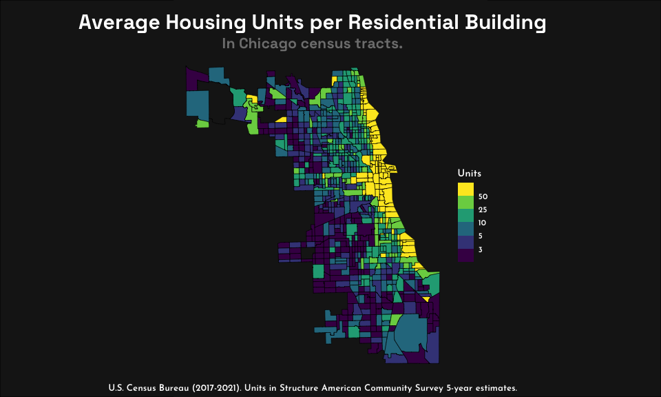

Housing Stock Choropleth
================

First we’ll load the packages.

``` r
library(tidyverse)
library(sf)
```

Then we’ll load in our census data and turn it into a data table.

``` r
tracts <- st_read("SHP/SHP_chicago-tracts_housing-stock/acs2021_5yr_B25024_14000US17031010502.shp", quiet = TRUE)

tracts_df <- fortify(tracts)
```

But these column names aren’t very descriptive and some are unnecessary.
We’ll only select a few and rename them to be more helpful.

``` r
tracts_cleaned <- tracts_df %>% 
  select(geoid, 
         name, 
         geometry, 
         total_units = B25024001, 
         one_detached = B25024002, 
         one_attached = B25024003, 
         two = B25024004, 
         three_or_four = B25024005, 
         five_to_nine = B25024006, 
         ten_to_nineteen = B25024007, 
         twenty_to_fortynine = B25024008, 
         fifty_plus = B25024009)
```

Then we’ll calculate the average housing units per each tract. (The
weighting isn’t going to be perfect. I only took the average value from
each variable \[e.g. (5 + 9)/2 = 7\] but it should be good enough to see
trends.)

``` r
tracts_average_units <- tracts_cleaned %>% 
  mutate(average_units = (one_detached + one_attached + (two * 2) + (three_or_four * 3.5) + (five_to_nine * 7) + (ten_to_nineteen * 14.5) + (twenty_to_fortynine * 34.5) + (fifty_plus * 100))/total_units, .after = total_units)
```

Finally we just have to plot it.

``` r
housing_units <- ggplot(tracts_average_units) +
  geom_sf(aes(fill = average_units),
              color = "black"
  ) +
  labs(
    title = "Average Housing Units per Residential Building",
    subtitle = "In Chicago census tracts.",
    fill = "Units",
    caption = "U.S. Census Bureau (2017-2021). Units in Structure American Community Survey 5-year estimates."
  ) +
  scale_fill_viridis_b(breaks = c(0, 3, 5, 10, 25, 50, 100), na.value = "gray10") +
  theme_void() +
  theme(
    plot.title = element_text(family = "Space Grotesk Bold",
                              size = 22.5, 
                              hjust = 0.5, 
                              color = "white"),
    plot.subtitle = element_text(family = "Space Grotesk Bold",
                                 size = 16,
                                 hjust = 0.5,
                                 color = "gray50"),
    plot.background = element_rect(fill = "gray10", 
                                   color = NA),
    plot.caption = element_text(family = "Josefin Sans SemiBold",
                                color = "white",
                                size = 10,
                                hjust = 0.5),
    legend.text = element_text(family = "Josefin Sans SemiBold",
                               color = "white"),
    legend.title = element_text(family = "Josefin Sans SemiBold",
                                color = "white"),
    plot.margin = margin(10, 0, 5, 0)
  )
grid::grid.newpage()
grid::grid.draw(grid::rectGrob(gp = grid::gpar(fill = "gray10")))
print(housing_units, newpage = FALSE)
```

<!-- -->
