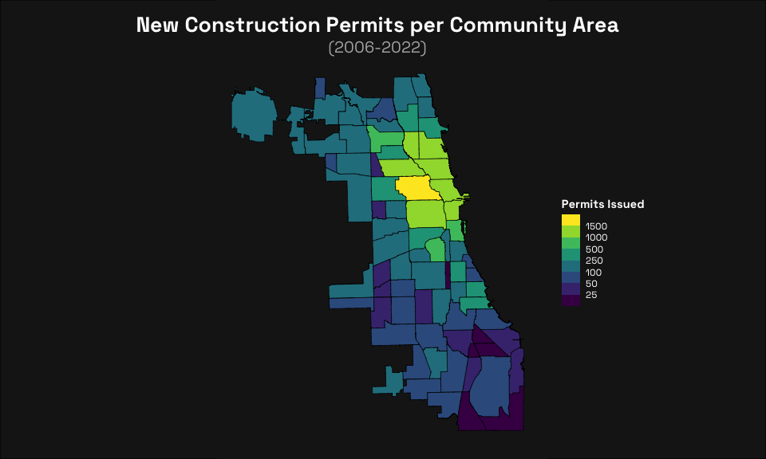

New Construction in Chicago by Community Area
================

Libraries!

``` r
library(tidyverse)
library(lubridate)
library(data.table)
library(sf)
```

Then we have to deal with the fact that most of the construction permit
dataset is useless.

``` r
# read in data
new_construction_bad_date <- fread("CSV/CSV_chicago_building-permits.csv") %>%  
  select("PERMIT_TYPE", "ISSUE_DATE", "REPORTED_COST", "COMMUNITY_AREA", "XCOORDINATE", "YCOORDINATE", "LATITUDE", "LONGITUDE") %>% # selects relevant columns
  filter(PERMIT_TYPE == "PERMIT - NEW CONSTRUCTION") %>% # only new construction
  filter(!is.na(COMMUNITY_AREA)) # community area has to have a value

# make ISSUE_DATE column actually dates
new_construction <- new_construction_bad_date %>% 
  mutate(ISSUE_DATE = mdy(ISSUE_DATE)) %>% 
  arrange(ISSUE_DATE) # sorts

new_construction
```

    ##                      PERMIT_TYPE ISSUE_DATE REPORTED_COST COMMUNITY_AREA
    ##     1: PERMIT - NEW CONSTRUCTION 2006-04-21        450000             23
    ##     2: PERMIT - NEW CONSTRUCTION 2007-01-23        225000             28
    ##     3: PERMIT - NEW CONSTRUCTION 2007-01-23        225000             28
    ##     4: PERMIT - NEW CONSTRUCTION 2007-07-30             1              2
    ##     5: PERMIT - NEW CONSTRUCTION 2007-08-02       7500000              8
    ##    ---                                                                  
    ## 20824: PERMIT - NEW CONSTRUCTION 2022-12-23        500000             77
    ## 20825: PERMIT - NEW CONSTRUCTION 2022-12-23        220000             65
    ## 20826: PERMIT - NEW CONSTRUCTION 2022-12-23        450000             25
    ## 20827: PERMIT - NEW CONSTRUCTION 2022-12-23        350000             15
    ## 20828: PERMIT - NEW CONSTRUCTION 2022-12-23          2000             35
    ##        XCOORDINATE YCOORDINATE LATITUDE LONGITUDE
    ##     1:     1154346     1911673 41.91346 -87.70840
    ##     2:     1170743     1902041 41.88668 -87.64844
    ##     3:     1170697     1902039 41.88668 -87.64861
    ##     4:     1157863     1942517 41.99802 -87.69463
    ##     5:     1175391     1905089 41.89494 -87.63128
    ##    ---                                           
    ## 20824:     1163290     1940798 41.99319 -87.67472
    ## 20825:     1153384     1859901 41.77141 -87.71330
    ## 20826:     1138563     1899698 41.88090 -87.76667
    ## 20827:     1137708     1930722 41.96605 -87.76906
    ## 20828:     1177509     1879199 41.82385 -87.62429

After cleaning the permit data, we need to import the community area
shapefile.

``` r
community_areas <- st_read("SHP/SHP_chicago-communities/geo_export_e07d67fa-91ce-4d30-9da3-eb903021731c.shp", quiet = TRUE)

community_areas_fortified <- fortify(community_areas) # turns shapefile into dataframe

ggplot(data = community_areas) +
  geom_sf(data = community_areas_fortified) +
  theme_void()
```

<!-- -->

Now it’s time to join the data and community shapes.

``` r
new_construction_totals <- new_construction %>% 
  group_by(COMMUNITY_AREA) %>% 
  summarize(total_permits = n()) %>% 
  filter(COMMUNITY_AREA != 0) # for some reason there were some community area "0" observations?

# joins have to be on the same variable class
new_construction_totals$COMMUNITY_AREA <- as.character(new_construction_totals$COMMUNITY_AREA)

chicago_community_choropleth_data <- left_join(community_areas_fortified, new_construction_totals, by = c("area_num_1" = "COMMUNITY_AREA"))
```

And finally we plot it!

``` r
plot <- ggplot() +  
  geom_sf(
    data = chicago_community_choropleth_data,
    aes(fill = total_permits),
    color = "black"
  ) +
  labs(    
    title = "New Construction Permits per Community Area",
    subtitle = "(2006-2022)"
  ) +
  scale_fill_viridis_b(
    breaks = c(25, 50, 100, 250, 500, 1000, 1500), 
    name = "Permits Issued"
  ) +
  theme_void() +
  theme(
        plot.title = element_text(size = 20, 
                                  color = "white", 
                                  family = "Space Grotesk", 
                                  face = "bold", 
                                  hjust = 0.5),    
        plot.subtitle = element_text(size = 15, 
                                     color = "gray70", 
                                     family = "Space Grotesk", 
                                     face = "italic", 
                                     hjust = 0.5),    
        legend.title = element_text(color = "white", 
                                    family = "Space Grotesk", 
                                    face = "bold"),    
        legend.text = element_text(color = "white", 
                                   family = "Space Grotesk"),    
        plot.margin = margin(10, 10, 10, 0),
        legend.position = c(1.2, 0.5),
        plot.background = element_rect(fill = "gray10", color = NA)
  )
# Below sets the background to be completely gray; otherwise it isn't.
grid::grid.newpage()
grid::grid.draw(grid::rectGrob(gp = grid::gpar(fill = "gray10")))
print(plot, newpage = FALSE)
```

<!-- -->
