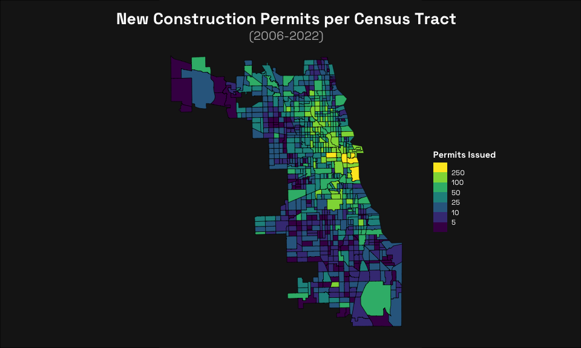

New Construction in Chicago by Census Tract
================

``` r
library(tidyverse)
library(sf)
library(data.table)
```

``` r
new_construction <- fread("CSV/CSV_chicago_building-permits.csv") %>%  
  select("PERMIT_TYPE", "ISSUE_DATE", "REPORTED_COST", "COMMUNITY_AREA", "XCOORDINATE", "YCOORDINATE", "LATITUDE", "LONGITUDE") %>% # selects relevant columns
  filter(PERMIT_TYPE == "PERMIT - NEW CONSTRUCTION") %>% # only new construction
  filter(!is.na(LATITUDE) & !is.na(LONGITUDE)) # has to have lat & long
```

``` r
tracts <- read_sf("SHP/SHP_chicago-tracts/acs2021_5yr_B01003_14000US17031010502.shp", quiet = TRUE)
```

``` r
constructin_geo <- st_as_sf(new_construction, coords = c("LONGITUDE", "LATITUDE"))

st_crs(tracts)
```

    ## Coordinate Reference System:
    ##   User input: WGS 84 
    ##   wkt:
    ## GEOGCRS["WGS 84",
    ##     DATUM["World Geodetic System 1984",
    ##         ELLIPSOID["WGS 84",6378137,298.257223563,
    ##             LENGTHUNIT["metre",1]]],
    ##     PRIMEM["Greenwich",0,
    ##         ANGLEUNIT["degree",0.0174532925199433]],
    ##     CS[ellipsoidal,2],
    ##         AXIS["latitude",north,
    ##             ORDER[1],
    ##             ANGLEUNIT["degree",0.0174532925199433]],
    ##         AXIS["longitude",east,
    ##             ORDER[2],
    ##             ANGLEUNIT["degree",0.0174532925199433]],
    ##     ID["EPSG",4326]]

``` r
constructin_geo <- constructin_geo %>% 
  st_set_crs(st_crs(tracts))


result <- st_within(constructin_geo, tracts, sparse = FALSE)
```

``` r
tracts_choro <- tracts %>% 
  mutate(Count = apply(result, 2, sum))

tracts_plot <- ggplot(tracts_choro) +
  geom_sf(aes(fill = Count),
          color = "black") +
  labs(
    title = "New Construction Permits per Census Tract",
    subtitle = "(2006-2022)"
  ) +
  scale_fill_viridis_b(breaks = c(5, 10, 25, 50, 100, 250),
                       name = "Permits Issued") +
  theme_void() +
  theme(
          plot.title = element_text(size = 20, 
                                    color = "white", 
                                    family = "Space Grotesk", 
                                    face = "bold", 
                                    hjust = 0.5),    
          plot.subtitle = element_text(size = 15, 
                                       color = "gray70", 
                                       family = "Space Grotesk", 
                                       face = "italic", 
                                       hjust = 0.5),    
          legend.title = element_text(color = "white", 
                                      family = "Space Grotesk", 
                                      face = "bold"),    
          legend.text = element_text(color = "white", 
                                     family = "Space Grotesk"),    
          plot.margin = margin(10, 10, 10, 0),
          legend.position = c(1.2, 0.5),
          plot.background = element_rect(fill = "gray10", color = NA)
        )
grid::grid.newpage()
grid::grid.draw(grid::rectGrob(gp = grid::gpar(fill = "gray10")))
print(tracts_plot, newpage = FALSE)
```

<!-- -->
